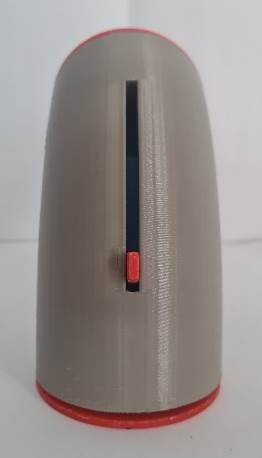
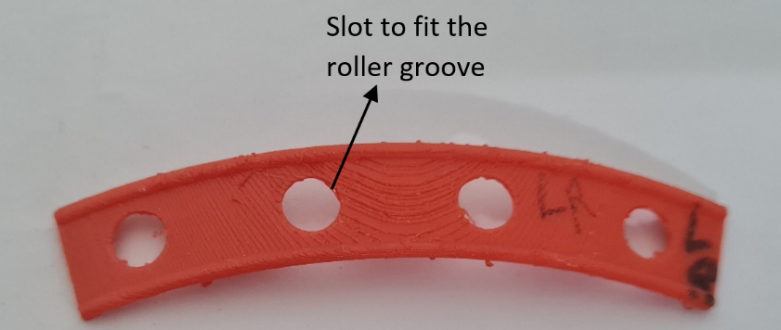
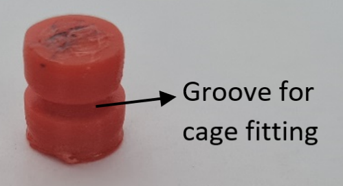

# Segmented Toroidal Actuator

## Patent Application Number - 202411029477
**Published in Journal Number- 19/2024, Date: 10/05/2024 -Indian Patent Office**

## Applied by
- **Ma. Shubham Puri Goswami**
- **Prof. Ajat Shatru Arora**
- **Prof. Surita Maini**

---
This invention introduces a curved hydraulic cylinder for hinge actuation in limited spaces, overcoming differential circular motion issues in conventional linear cylinder setups. It features a solid segmented toroidal inner rod, a shorter segmented toroidal piston, a unique three-seal placement, and a conical roller with a cage structure for smooth piston gliding. The design overcomes issues such as telescopic piston banking, seal wear, and large fluid volume requirements in heavier cylinders while achieving up to 180° motion.

## Model Representation

  <table style="border-collapse: collapse; border: none;">
    <tr>
      <td align="center"><b>CAD View of the Model</b></td>
      <td align="center"><b>Actual Image of the Prototype</b></td>
    </tr>
    <tr>
      <td></td>
      <td></td>
    </tr>
  </table>

---

## Different Views

  <table style="border-collapse: collapse; border: none;">
    <tr>
      <td align="center"><b>Front View</b></td>
      <td align="center"><b>Side View</b></td>
      <td align="center"><b>Top View</b></td>
    </tr>
    <tr>
      <td></td>
      <td></td>
      <td></td>
    </tr>
  </table>

## **WORKING PRINCIPLE**
It is a hydraulic cylinder actuator mechanism which provides motion on a circular trajectory using hydraulic pressure.  
Its working principle is based on a typical hydraulic cylinder actuator, in which a hydraulic pump delivers pressurized fluid that appears between the piston and cylinder chamber, causing it to expand. The expanding chamber motion is taken as the movement of the piston, thus acting as the actuator's output.

---

  
  
<i>Illustration of the Working Principle</i>

---

When the fluid is pumped into the respective holes, it enters the chamber created between the cylinder and piston, sealed by the oil seals of the piston and bifurcated by the oil seal of the inner rod. This fluid exerts pressure on all the walls, producing force against the piston’s closing wall, forcing it to move. Similarly, the fluid is pumped via another hole into the other chamber in the next stroke to create backward motion. Thus, the **forward and backward motion** of the piston is achieved using **hydraulic fluid pressure**.

## **BASIC METHODOLOGY OF OPERATION AND WORKING**
The same principle is used to take the output of this device, where the hydraulic fluid is pumped into **hole1**, which appears in the chamber between the piston and inner rod on one side of the piston, causing the chamber to expand. As a result, the **flange attached to the piston moves on a circular track**, creating the **forward motion stroke** of the actuator mechanism.  

Similarly, the fluid is pumped into **hole2** (keeping hole1 at zero pressure to drain the accumulated fluid). This fluid appears in the chamber but on the other side of the piston, causing the expansion of this chamber and collapsing the previous chamber, accounting for the **backward stroke**. This **piston motion** is transferred to the flange, causing it to move on the **same circular track** for the backward stroke.

---

  <table style="border-collapse: collapse; border: none;">
    <tr>
      <td align="center"><b>Forward Stroke</b></td>
      <td align="center"><b>Backward Stroke</b></td>
    </tr>
    <tr>
      <td></td>
      <td></td>
    </tr>
  </table>

## **APPLICATIONS**

### **• Heavy Dumping Equipment**
The entanglement of the telescopic hydraulic cylinder under tangential force can be avoided by using a **curved hydraulic cylinder**. The structure of our design is completely **rigid and confined** to its trajectory. Hence, it can bear **significant tangential and other forces** on its actuation end (flange) and transfer these forces throughout the outer cylinder into the supporting structure.

  <table>
    <tr>
      <td align="center"><b>Telescopic Cylinder</b></td>
      <td align="center"><b>Entanglement and Failure of Telescopic Cylinder under heavy Tangential Load</b></td>
    </tr>
    <tr>
      <td></td>
      <td></td>
    </tr>
  </table>

This entanglement can be avoided by using our structure. Moreover, the system can bear **significant tangential forces**.

  

---

### **• Compact Hinge Actuation of Excavators and Dumping Equipments**

### **• Extended Motion to Hinge**
The hydraulic cylinders used for actuation of gates and doors typically **work up to 90 degrees**. Our **curved hydraulic cylinder** can be used to **extend the motion up to 180 degrees**.

  <table>
    <tr>
      <td align="center"><b>Restricted 90-degree Motion of Conventional Cylinder</b></td>
      <td align="center"><b>Extended Motion Up to 180 Degrees</b></td>
    </tr>
    <tr>
      <td></td>
      <td></td>
    </tr>
  </table>

---

### **• Direct Hinge and Actuator Replacement**
The system can be used as an **extended piston from the cylinder body** instead of a flange for actuation. In this mechanism, the **extended piston body itself acts as the actuator**.

The mechanisms used for **hinged actuation** are generally **geared mechanisms**, which are unsuitable for heavy doors due to mechanical limitations. Heavy loads **break the teeth of gears and actuating rods**. Our system can be used with an **extended piston structure** to operate between two faces, where the piston itself serves as the actuating element.

The **roller cage mechanism** itself works as a hinge, **eliminating the need for a separate hinge**.

  <table>
    <tr>
      <td align="center"><b>Conventional Gear Hinge Mechanism</b></td>
      <td align="center"><b>Curved Hydraulic Cylinder as Hinge</b></td>
    </tr>
    <tr>
      <td></td>
      <td></td>
    </tr>
  </table>

---

### **• Heavy Actuation of Bunker Gates**
Heavy loads, such as **bunker gates and dam gates**, require **high-strength conventional hydraulic cylinders**. The **heavy weight of the piston-cylinder mechanism** causes the piston to **tilt under gravity**, leading to **failure of hydraulic seals** and ultimately, **hydraulic system failure**.

  <table>
    <tr>
      <td align="center"><b>Heavy Bunker Gate Actuation</b></td>
      <td align="center"><b>Banking of Piston Under Its Own Weight</b></td>
    </tr>
    <tr>
      <td></td>
      <td></td>
    </tr>
  </table>

This system can be replaced with our curved hydraulic cylinder, which can **bear significant tangential loads** as well as **heavy actuating loads**.

  

## **PARTS**

  <table>
    <tr>
      <td align="center"><b>De-constructed View of Prototype</b></td>
    </tr>
    <tr>
      <td></td>
    </tr>
  </table>

---

### **Piston and Inner Rod**
The **holes 1 and 2** start from the **end cap** of the **inner rod** and go all the way inside the inner rod to appear at its surface, as shown.

  <table>
    <tr>
      <td align="center"><b>Piston</b></td>
      <td align="center"><b>Inner Rod</b></td>
    </tr>
    <tr>
      <td></td>
      <td></td>
    </tr>
  </table>

---

## **INTERNAL WORKING**
To overcome the **friction** encountered by the piston while following the **circular trajectory** marked and defined by the **outer cylinder**, the **piston is supported by a set of rollers**, guiding it along the circular path. This **outer cylinder** serves solely to **define and constrain the motion** of the piston. **Hydraulics are not part of this guiding system**—it is a purely mechanical setup aimed at eliminating **sliding friction** between the piston and other parts of the actuator mechanism. The **rollers** act as constrained gears, rolling **between the inner surface of the outer cylinder and the outer surface of the piston**.

---
### **De-constructed Piston**

  <table>
    <tr>
      <td align="center"><b>De-constructed Piston and Outer Cylinder</b></td>
    </tr>
    <tr>
      <td></td>
    </tr>
  </table>

The **inner surface of the outer curved cylinder** has **grooves cut** into it, mirrored on the **outer surface of the piston**. The grooves create **housings for rollers**, ensuring **smooth gliding of the piston** within the constrained trajectory.

### **Outer Cylinder**

  <table>
    <tr>
      <td align="center"><b>Outer Cylinder</b></td>
    </tr>
    <tr>
      <td></td>
    </tr>
  </table>

When the **piston is forced by the hydraulic mechanism**, it **glides on the rolling surface provided by the rollers**. These **rollers move along the defined circular trajectory** of the outer cylinder, creating **perfect rolling motion** between the piston and the cylinder. Since rollers are eventually **no longer supported on the piston surface**, a **cage structure holds the rollers in position**. The **cage moves along with the rollers** as the piston moves forward.

  <table>
    <tr>
      <td></td>
    </tr>
  </table>

---

## **ROLLER AND CAGE STRUCTURE**
The **rollers have a circular groove** cut along their circumference, fitting into an **identical slot in the cage structure**. The dimensions of the **roller groove** and **cage slot** are identical, allowing **secure placement** while enabling the rollers to **rotate freely along their vertical axis**.

  <table>
    <tr>
      <td align="center"><b>Cage Structure</b></td>
      <td align="center"><b>Roller Structure</b></td>
    </tr>
    <tr>
      <td></td>
      <td></td>
    </tr>
  </table>

---

### **Assembled Roller Cage Structure**
The **cage has circular bumps along its rim**, fitting into the **slots cut along the inner surface of the outer cylinder and the outer surface of the piston**. These **bumps keep the roller cage in position**, ensuring **smooth movement** along the cavity between the **outer cylinder and piston**.

This design further **enhances contact between the roller, the inner cylinder surface, and the outer piston surface**, enabling **smooth gliding motion**. The **cage and rollers work as constrained gears**, ensuring **seamless movement along the defined circular path**.

  <table>
    <tr>
      <td align="center"><b>Assembled Roller Cage Structure</b></td>
    </tr>
    <tr>
      <td></td>
    </tr>
  </table>

## **MATHEMATICS OF CURVED TRAJECTORY**

### **Perfect Rolling Between Two Slanted Surfaces on a Circular Trajectory**

  

The motion of the moving surface follows a circular path around a reference axis, with the supporting surfaces inclined to the horizontal flat plane. This results in the rollers moving on a **banked circular track**. To maintain this trajectory, the rollers are **frustum-shaped**, allowing a continuous gradient in diameter. This ensures **perfect rolling motion** on the slanted lower track.

In this system:
- The **rollers revolve** around the reference axis on a flat plane.
- The **rollers rotate** on their own axis to traverse the path.
- A **curved upper surface** glides smoothly on the rollers.
- The rollers act as a **geared coupling** between the stationary lower and upper slanted curved surfaces.

This ensures **perfect rolling motion** of the upper surface over the stationary lower surface.

---

### **Structural Drawing for the Above System**

  <table>
    <tr>
      <td align="center"><b>Structural Drawing for the Above System</b></td>
      <td align="center"><b>Fig - 1</b></td>
    </tr>
    <tr>
      <td></td>
      <td></td>
    </tr>
  </table>

### **Mathematical Formulation as per fig-1**

  

## MOTION OF PISTON IN CYLINDER

A mechanism similar to the above-mentioned mechanism is applied between the inner surface of the cylinder and the outer surface of the piston. The grooves cut into the inner surface of the cylinder work as stationary support surfaces for the rollers to roll, while the grooves cut into the outer surface of the piston tend to glide the piston along the rolling surface of the rollers. This mechanism is deployed at a continuous interval of 45 degrees. Thus, 4 roller sets roll to provide perfect rolling between the cylinder and piston surface. The flange attached to the piston extends via the slit in the outer cylinder to transmit the piston motion to the outer environment.

### Motion of piston in the cylinder

  

| **Piston at initial position** | **Piston at mid position** | **Piston at final position** |
|:-----------------------------:|:-------------------------:|:--------------------------:|
| **Flange position**    | **Flange position**    | **Flange position**     |
| **Roller cage position**     | **Roller cage position**    | **Roller cage position**    |

## CAD View of the Model

## Actual Image of the Prototype

---

## Different Views

### Front View

### Top View

### Side View

---

## WORKING PRINCIPLE
This hydraulic cylinder actuator mechanism provides motion on a circular trajectory using hydraulic pressure. 

Its working principle is based on a typical hydraulic cylinder actuator, where a hydraulic pump delivers pressurized fluid between the piston and cylinder chamber, causing it to expand. The expanding chamber motion is taken as the movement of the piston, thus serving as the actuator's output.

---

## BASIC METHODOLOGY OF OPERATION AND WORKING

The hydraulic fluid is pumped into **hole1**, appearing in the chamber between the piston and inner rod on one side of the piston, causing expansion. As a result, the flange attached to the piston moves on a circular track, creating a **forward stroke** of the actuator mechanism.

Similarly, when fluid is pumped into **hole2** (while keeping hole1 at zero pressure to drain the accumulated fluid), it causes expansion in the opposite chamber, producing the **backward stroke**.

### Forward Stroke

### Backward Stroke

---

## APPLICATIONS

### Heavy Dumping Equipment
The **curved hydraulic cylinder** avoids the **entanglement of telescopic hydraulic cylinders** under tangential forces, ensuring a rigid structure confined to its trajectory, capable of bearing significant loads.

This entanglement can be avoided using our design, which can bear **significant tangential forces**.

### Extended Motion to Hinge
Conventional hydraulic cylinders for gate and door actuation are limited to **90 degrees**, while our **curved hydraulic cylinder** allows motion up to **180 degrees**.

  

### Direct Hinge and Actuator Replacement
Instead of a hinge, our system allows the **piston itself to work as an actuator**, eliminating gears and increasing durability.

  

### Heavy Actuation of Bunker Gates
Traditional heavy hydraulic cylinders fail due to **piston banking** under its own weight. Our design can withstand high tangential and actuating loads without failure.

---

## PARTS

### Deconstructed View of Prototype

### Piston & Inner Rod
  

---

## INTERNAL WORKING
To **reduce friction**, the piston is supported by **rollers** guiding it along a circular trajectory inside the outer cylinder.

### Deconstructed View of Piston and Outer Cylinder

The **roller cage structure** ensures smooth gliding by acting as a geared coupling between surfaces.

### Roller and Cage Structure
  
  

---

## MATHEMATICS OF CURVED TRAJECTORY
The motion follows a **banked circular track**. Rollers are shaped as **frustums** to ensure smooth motion.

### Structural Drawing

---

## MOTION OF PISTON IN CYLINDER
A mechanism similar to **geared rolling motion** is applied at **45-degree intervals** using four roller sets to provide a smooth motion.

### Motion of Piston

### Flange & Roller Cage Positions
  
  

---

## HYDRAULIC SYSTEM
The hydraulic fluid chamber is formed **between the inner rod and the inner surface of the piston**, sealed by oil seals to prevent leakage.

### Hydraulic System Components

Hydraulic fluid is pumped into **hole1**, creating forward motion. Then, fluid is pumped into **hole2**, causing backward motion.

### Cut Section of Piston and Inner Rod Assembly

---

## CUT SECTION OF REFINED VERSION
The refined version has **wider edges** for more force generation while maintaining the roller cage mechanism.

---

## FINAL ASSEMBLY

### Forward Stroke

### Backward Stroke

---

## STL FILE OF THE ASSEMBLY
The **3D model** can be viewed using any **3D viewer**.
A **clearer view** with cut sections can be obtained by uploading the file at:
[3D Find It](https://www.3dfindit.com/en/3d-geometricsearch)

---

## 🚀 View the Web Page
👉 **[Click here to view](https://yourusername.github.io/repository-name/index.html)**

---
